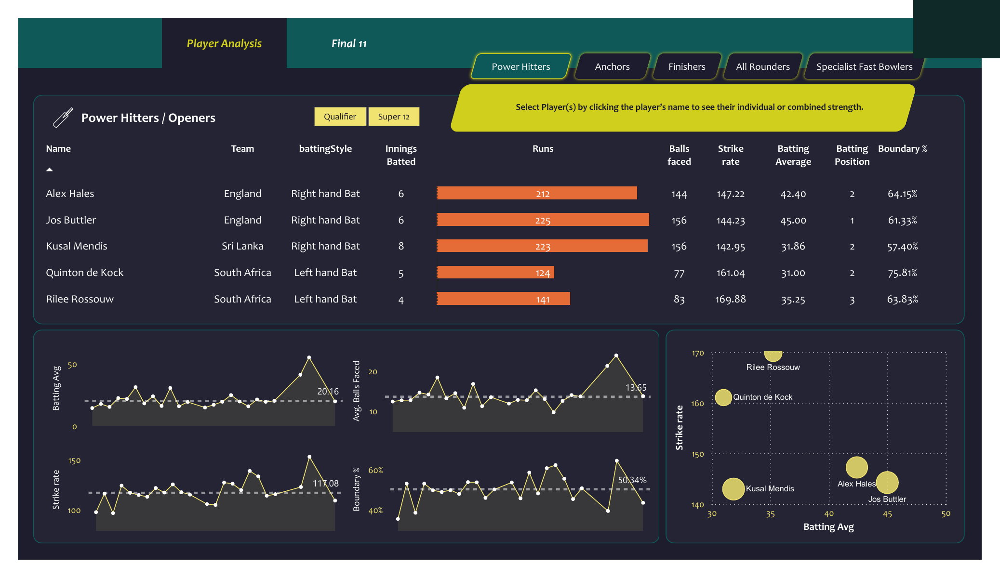

# 🏏 Cricket Player Performance Dashboard — Best Playing XI Selection
**Tool:** Power BI &nbsp;|&nbsp; **Domain:** Sports Analytics &nbsp;|&nbsp; **Dataset:** T20 World Cup 2022

An interactive Power BI dashboard to evaluate 50+ international cricket players across 5 role categories and select the **Best Playing XI** using data-driven performance metrics — Strike Rate, Batting Average, Boundary %, and more.

---

## 📊 Dashboard Preview



---

## 🎯 Business Problem

Cricket team selection is often subjective and based on opinion. This project takes a **data-driven approach** — using real T20 World Cup 2022 statistics to objectively evaluate players across roles and select the optimal playing XI based on performance KPIs.

---

## 💡 Key Insights

| # | Insight |
|---|---------|
| 1 | **Jos Buttler** — best Power Hitter with 225 runs at 144.23 strike rate |
| 2 | **Quinton de Kock** — highest Boundary % (75.81%) among openers |
| 3 | **Rilee Rossouw** — highest Strike Rate (169.88) among Power Hitters |
| 4 | Role-based filtering reveals **distinct performance patterns** per batting position |
| 5 | Scatter plot identifies players with best **Strike Rate vs Batting Average** combination |

---

## 👥 Role-Based Analysis

| Role | Key Metrics Used |
|------|-----------------|
| **Power Hitters / Openers** | Strike Rate, Boundary %, Batting Average |
| **Anchors** | Batting Average, Balls Faced, Consistency |
| **Finishers** | Strike Rate, Runs in death overs |
| **All Rounders** | Batting + Bowling combined performance |
| **Specialist Fast Bowlers** | Economy Rate, Wickets, Bowling Average |

---

## 📈 KPIs Tracked

| KPI | Description |
|-----|-------------|
| **Strike Rate** | Runs scored per 100 balls |
| **Batting Average** | Average runs per innings |
| **Boundary %** | % of runs from boundaries |
| **Avg. Balls Faced** | Average balls faced per innings |
| **Innings Batted** | Total innings played |
| **Batting Position** | Order of batting in lineup |

---

## 🏆 Power Hitters Selected

| Player | Team | Runs | Strike Rate | Boundary % |
|--------|------|------|-------------|------------|
| Jos Buttler | England | 225 | 144.23 | 61.33% |
| Alex Hales | England | 212 | 147.22 | 64.15% |
| Kusal Mendis | Sri Lanka | 223 | 142.95 | 57.40% |
| Quinton de Kock | South Africa | 124 | 161.04 | 75.81% |
| Rilee Rossouw | South Africa | 141 | 169.88 | 63.83% |

---

## 🛠️ Tools & Technologies

| Tool | Usage |
|------|-------|
| Power BI | Dashboard development and visualization |
| DAX | KPI calculations and measures |
| Power Query | Data cleaning and transformation (ETL) |
| Python | Data scraping and preprocessing |
| Excel | Raw data storage and preparation |

---

## 📋 Project Workflow

```
1. Data Collection   → T20 World Cup 2022 player statistics
2. Data Cleaning     → Python + Power Query
3. Data Modeling     → Relationships between tables
4. DAX Measures      → Strike Rate, Batting Avg, Boundary %
5. Dashboard Design  → 5 role tabs + Player Analysis + Final 11
6. Insights          → Role-based filtering and scatter plot analysis
```

---

## 📁 Files in this Repo

| File | Description |
|------|-------------|
| `Cricket_Dashboard.png` | Dashboard screenshot |
| `README.md` | Project documentation |

---

## 👤 Author

**Himanshu Chavhan** — Data Analyst
www.linkedin.com/in/himanshu-chavhan-b7a80123b
